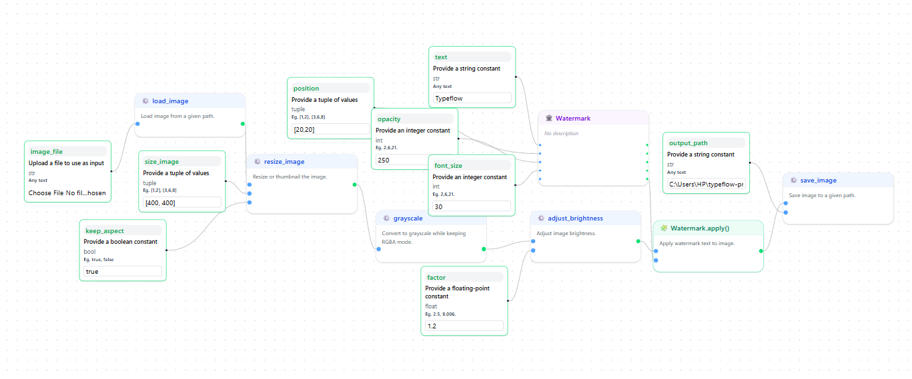

# Typeflow Editor

The **Typeflow Editor** is a powerful visual environment for designing and orchestrating workflows.  
It provides an intuitive **drag-and-drop interface** to create **Directed Acyclic Graphs (DAGs)** using your custom **nodes**, **classes**, and **I/O** components.

---

## Launching the Editor

Once you’ve created and validated your nodes and classes, simply run:

```bash
typeflow start-ui
```

This command will:

- Start the **FastAPI** server  
- Launch the **Next.js-powered Typeflow Editor** in your browser  

You’ll see an interactive canvas with toolbars, side panels, and buttons to help you build workflows visually.

---

## Editor Overview

Here’s the layout of the Typeflow Editor:

### 1. **Sidebar** (Left Panel)

The left sidebar contains tabs to organize all available building blocks:

| Tab       | Content |
|-----------|--------|
| **Inputs**     | Parameters, constants, and user-defined input nodes |
| **Functions**  | Your function-based nodes (created via `typeflow create-node`) |
| **Classes**    | Class-based nodes (created via `typeflow create-class`) |
| **Outputs**    | Terminal nodes that produce or save the final result |

> **Tip**: Drag any node from the sidebar into the main canvas to add it to your workflow.
> **Tip**: For deleting node in editor, click on it and press DELETE/ DEL/ BACKSPACE key.

<!-- Placeholder for image -->


---

### 2. **Editor Canvas** (Main Workspace)

This is your primary workspace — where you **drag and connect nodes** to define the flow of data and logic.

Each node appears as a visual block. You can:

- Connect outputs → inputs  
- Rearrange or rename nodes  
- Inspect or edit parameters  

Connections represent **data dependencies** — just like function pipelines in code.

<!-- Placeholder for image -->


---

### 3. **Top Toolbar**

At the top, you’ll find three primary controls:

| Button   | Description |
|----------|-----------|
| **Export**   | Export the current DAG as `dag.json` (great for version control or sharing) |
| **Import**   | Import a previously saved DAG to continue editing |
| **Start**    | **Compile and run** your workflow directly from the editor |

---

## Behind the Scenes

When you press **Start**:

1. The editor sends your **DAG JSON** to the **FastAPI backend**  
2. Typeflow automatically:  
   - Compiles the DAG  
   - Generates `src/orchestrator.py`  
   - Executes it in an **async subprocess**  
3. **Real-time logs & events** stream back via **Server-Sent Events (SSE)**  


---

## Tips for Efficient Editing

- Keep related nodes grouped visually  
- Use clear, descriptive node names  
- Reuse validated nodes across projects  
- **Export regularly** to avoid data loss  

---

## Example Workflow View

Here’s a complete image-processing workflow built in the editor:

1. Load an image  
2. Resize it  
3. Convert to grayscale  
4. Adjust brightness  
5. Add watermark  
6. Save output image  

<!-- Placeholder for full screenshot -->


---

## Next Steps

Once your workflow is ready:

- Click **Export** to save `dag.json`  
- Run these CLI commands to run in terminal:

```bash
typeflow compile
typeflow generate
typeflow run
```

**Pro tip**: Just hit **Start** in the Editor for instant execution with live feedback!

---

## Summary

| Feature              | Description                                      |
|----------------------|--------------------------------------------------|
| **Visual Builder**   | Drag-and-drop workflow creation                  |
| **Node Tabs**        | Organized inputs, functions, classes, outputs    |
| **Live Execution**   | Run workflows directly from UI                   |
| **SSE Integration**  | Real-time logs and node status updates           |
| **Import/Export**    | Save or load DAGs easily                         |

**Next**: Learn how Typeflow executes workflows behind the scenes in **[Workflow Execution](./workflow.md)**

---
